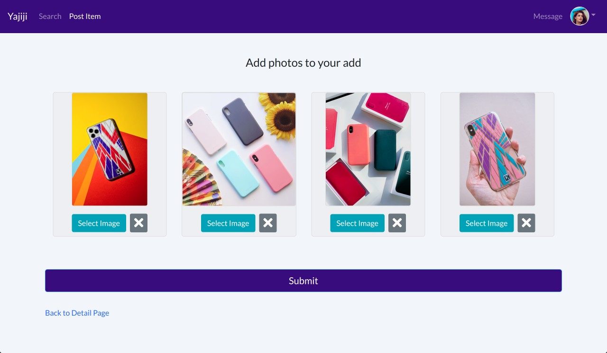
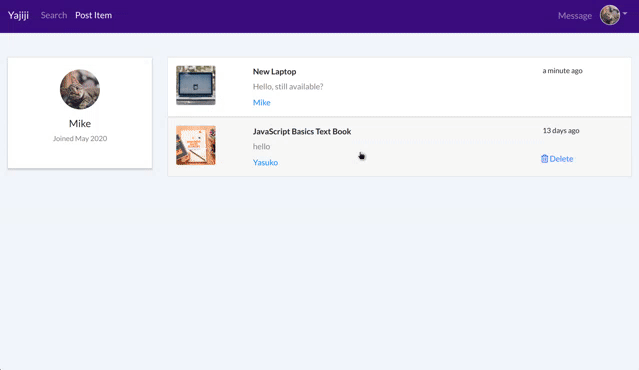

# Buy and Sell (Yajiji)

This is an application for buying and selling items.
The app allows users to post adds for things you want to sell and search for items you want to buy.  Either by the item's name or category.
Users can also send messages to the person who posted the add.
Responsive for both web and mobile.

## Requirements


## Getting Started 

* To get started, clone the repo to your local machine.

    ```https://github.com/ykurata/shop-app.git```

* Install all dependencies on the both front end and back end. 

    **Frontend (Client)**

    * Go to client directory, and run `npm install`.

    * To start client, run `npm start`.

    **Backend (Server)**
        
    * Go to recipe-app directory, and run `npm install`.

    * To start server, run `npm start`.


## Features
* #### Register/ Login / Logout

<br />
<br />
* ### Create adds for your items. 

<br />
<br />
* ### Add images for your items.

<br />
<br />
* ### Search items through items's name and category.
 
<br />
<br />
* ### Sending messages to other users.
 
<br />
<br />
* ### Replying to a message

<br />
<br />

        

## Built With 

* [NodeJS](https://nodejs.org/en/download/)
* [Postgres](https://www.postgresql.org/download/)
* [Express](https://expressjs.com/)
* [React](https://reactjs.org/)
